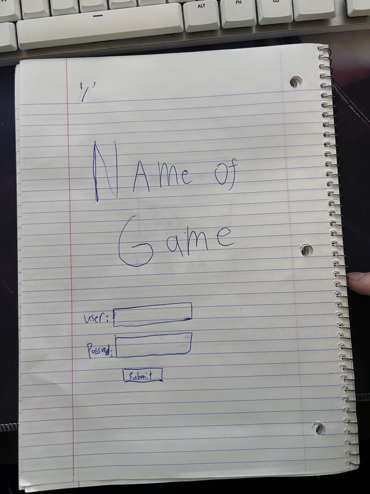
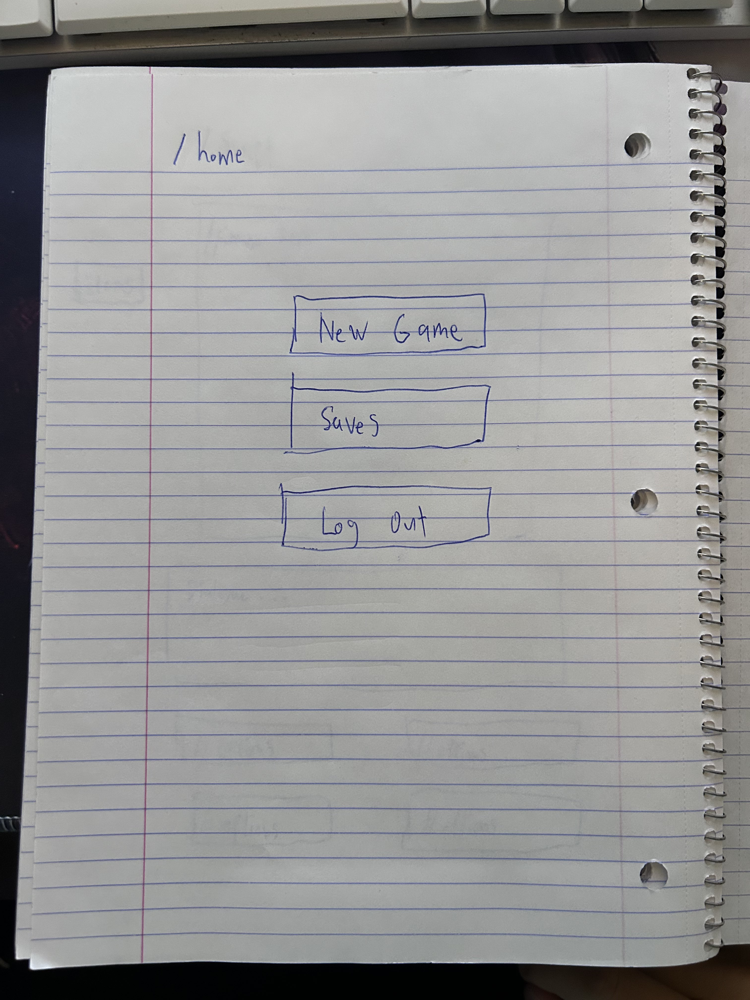
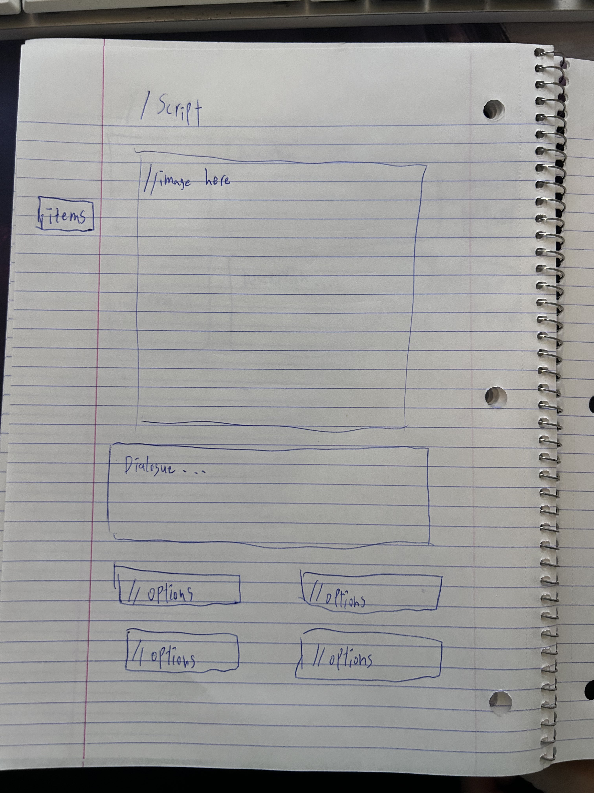
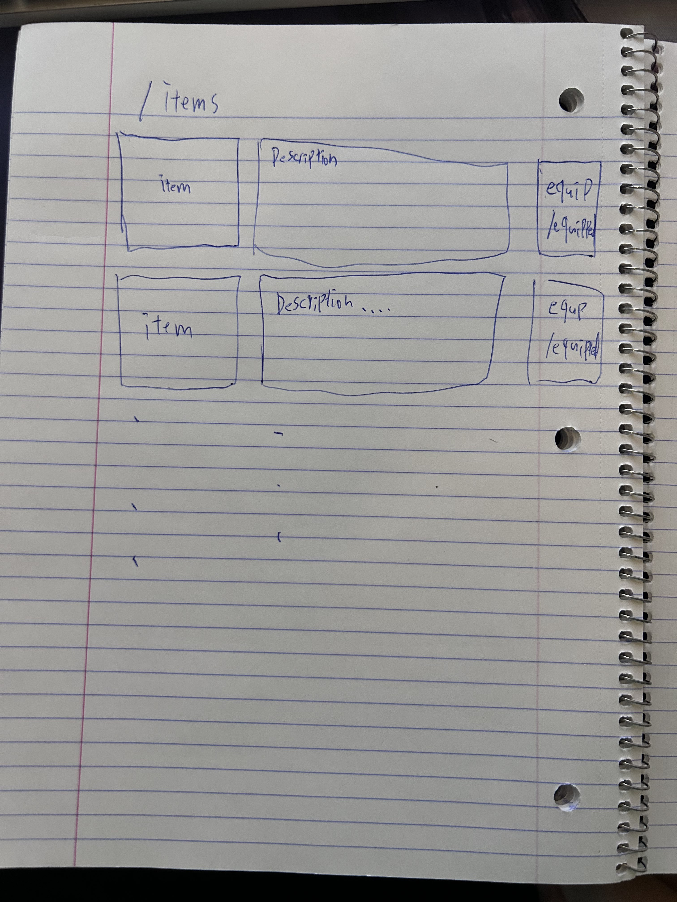
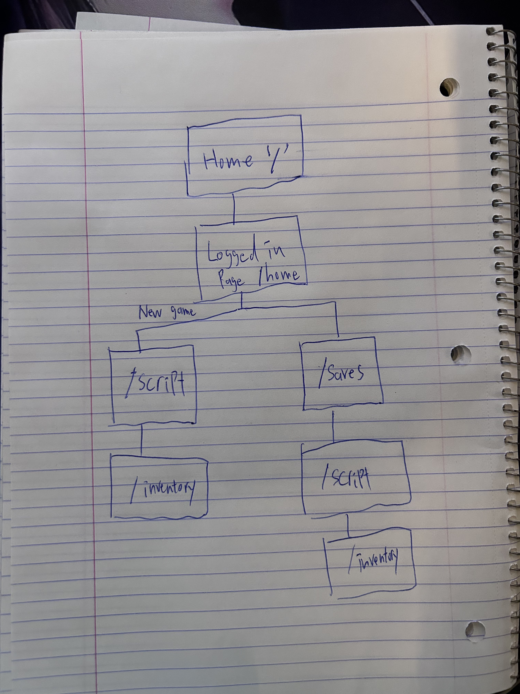

# Simple DnD Style Browser Game

## Overview

A simple web browser choose your adventure style game with a home page, user log in and save files, as well as a basic scene page that displays dialogue, action options, and hopefully some kind of visualization. There will also be an inventory page only accessible to the user once they are loaded into a game session, not from the home page.

The scenes(dialogue, options, etc... ) will be in a documents folder and then displayed by a scene page template based on the user's progress. I'm hoping to be able to use some kind of ai generated images for scenes using something like OpenAI image generation.

## Data Model

The application will store Users, Save Files and Scenes

- users will include a username and password, and a list of save files
- Each save will include items, critical dialogue options, and progress made.
- Each Scene will include dialogue options, response options, and the generative image prompts. (might be stored locally because of the amount of strings)

An Example User:

Users are handled by cloudbase authentication so their default user object is used

An Example save with:

```javascript
{
  userid: uid; // a reference to a User object
  progress: scene; //reference to a scene or specific dialogue in a scene
}
```

## Wireframes

/:default log in page



/home: the home page for selecting new game or saves



/script - page for gameplay



/items only if i have time to implement an item system+combat



## Site map



## User Stories or Use Cases

(**TODO**: write out how your application will be used through [user stories](http://en.wikipedia.org/wiki/User_story#Format) and / or [use cases](https://en.wikipedia.org/wiki/Use_case))

1. as non-registered user, I can register a new account with the site
2. as a user, I can log in to the site
3. as a user, I can reset my game or load back into my previous point
4. as a user, I can play through the game by selecting dialogue options

## Research Topics

- (5 points) Integrate user authentication
  - I'm going to be using firebase for user authentication
  - And account has been made for testing; I'll email you the password
  - see <code>cs.nyu.edu/~jversoza/ait-final/register</code> for register page
  - see <code>cs.nyu.edu/~jversoza/ait-final/login</code> for login page
- (2 points) Integrating OpenAi image generation
  - I'm going to use this api to generate images for the game
    \*the challenge will be to maintain consistency of style
- (5 points) React frontend framework
  - Learn and use somekinf od frontend framework such as react
- Create and deploy with firebase my own fetch api
  - used to fetch image url generated from openai securely

10 points total out of 8 required points (**\_TODO**: addtional points will **not** count for extra credit)

## [Link to Initial Main Project File](app.mjs)

## Milestone 3 Update

1. implemented openai DALL-E api
2. created resting api to process DALL-E requests while keeping api keys hidden(D: took me way too long)
3. added styling so no images appear before generated

## Deviations

1. I determined that using objects to store per scene dialogue would be restricting to the experience, so each scene will be a new function that is routed
2. Made Additional API to process OpenAI calls without displaying API KEY on the client side

## Milestone 4/final goals

1. implement log in and user game save
2. implement another form for inventory itmes
3. finish chapter one of the story

## Milestone 4/update

1. finished implementing user progress saves
2. implemented firebase realtime database for saves
3. added some additional scenes
4. improved on log in and sign up forms
